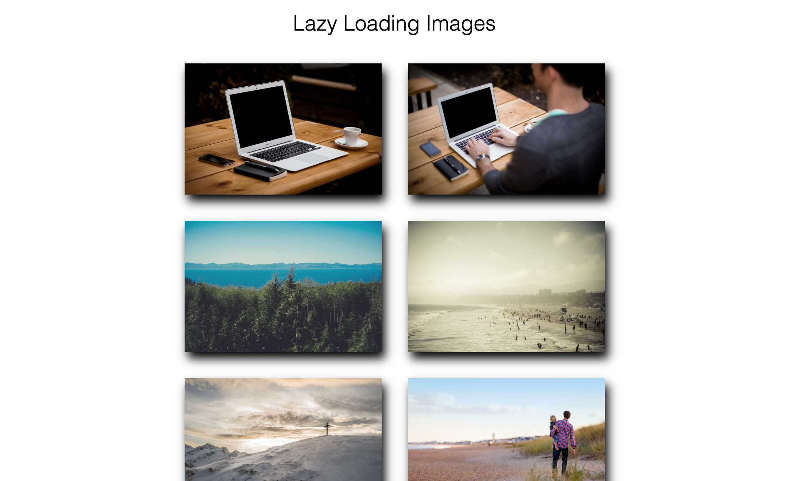

# dom-lazy-load
Lazy Load Images with Vanilla Javascript



## Intersection Observer API
- Information about where a certain element happens to be in relation to the viewport
- Alternative to adding listeners to scroll events 

```javascript
const myImgs = document.querySelectorAll('.animate-me');

observer = new IntersectionObserver(entries => {
  entries.forEach(entry => {
    if (entry.intersectionRatio > 0) {
      console.log('in the view');
      entry.target.classList.add('fancy');
      observer.unobserve(entry.target);
    } else {
      console.log('out of view');
      entry.target.classList.remove('fancy');
    }
  });
});

myImgs.forEach(image => {
  observer.observe(image);
});
```

## Use Cases 
- Lazy loading of images
- Infinite scrolls
- Pre-fetching of links when they appear on the screen
- To detect whether an ad was viewed or not
- To determine whether a user has read an article and to what extent
- To run costly renderings and animations only when they are visible on the screen